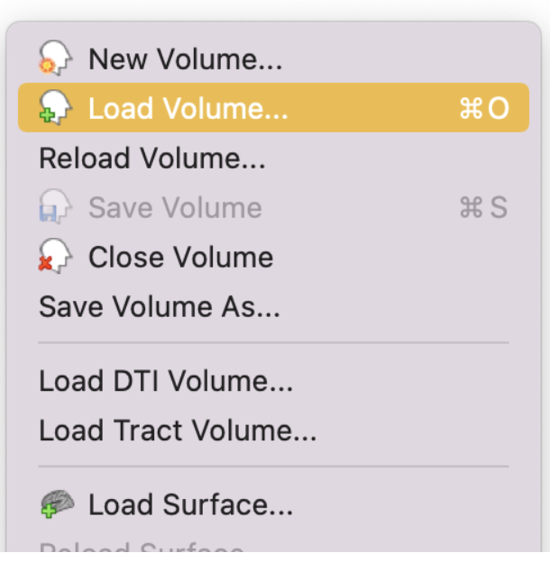
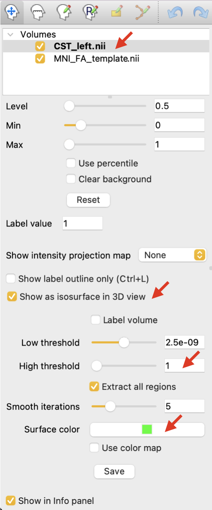
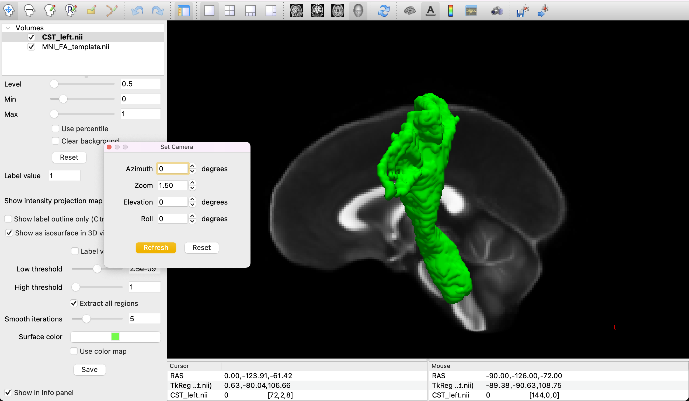
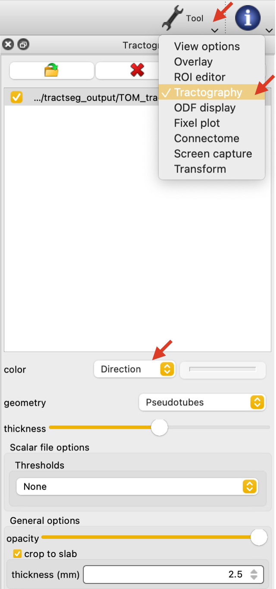
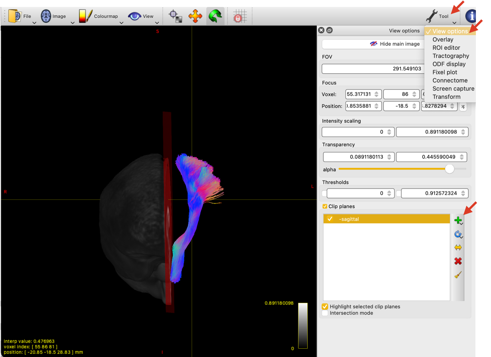

## Visualization of bundles
Once the bundles are reconstructed, you might want to create a figure showing the segmented bundles. TractSeg provides both the bundle segmentations (in nii.gz format) and bundle-specific tractograms called Tract Orientation Maps (TOMs; in .tck format).

In this guide, we will use Freeview from [FreeSurfer](https://surfer.nmr.mgh.harvard.edu/) and MRview from [MRtrix3](https://www.mrtrix.org/).

---

### Bundle segmentations
#### Freeview

In Freeview select 'Load Volume' to import both the tract image and the background image (e.g., FA MNI template).

{: width="200px" height="150px"}

Highlight the tract volume. Select to 'Show as isosurface in 3D view'. Adjust the upper threshold to `1`. Finally, select the color to show the tract.

{: width="200px" height="150px"}

To play with how the figure is visualized, go to 'View'>'Set camera' and adjust the values as you wish.

{: width="400px" height="300px"}

---

### Bundle tractograms
#### MRview

In MRview, go to 'File'>'Open' to load a background image (e.g., FA MNI template). In order to load the bundle tractogram (.tck), go to 'Tool'>'Tractography'.

If 'color'>'Direction' is selected, the bundle visualization will follow the usual: red for right-left, blue for foot-head, green for anterior-posterior.

{: width="200px" height="150px"}

To visualize the tract in 3D space, go to 'View'>'Volume render'. This will render the background image in 3D space as well. In 'Tool'>'View options', clip planes to show the tract. To play with how the figure is visualized, go to 'Tool'>'Screen capture' and adjust the values as you wish.

{: width="400px" height="300px"}